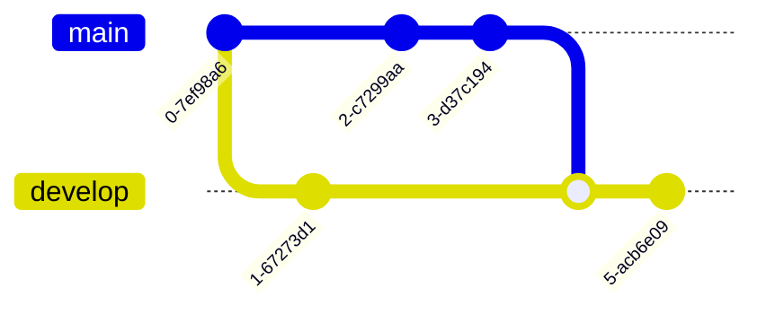

# Mermaid

## Getting Started

Mermaid is a JavaScript-based diagramming and charting tool that renders Markdown-inspired text definitions to create and modify diagrams dynamically. 

### Including Mermaid

To use Mermaid in your project, include the following script in your HTML:

```html
<script type="module">
  import mermaid from 'https://cdn.jsdelivr.net/npm/mermaid@10/dist/mermaid.esm.min.mjs';
  mermaid.initialize({ startOnLoad: true });
</script>
```

## Flowchart

### Basic Flowchart


### Flowchart with Text and Styles


## Sequence Diagram

### Basic Sequence Diagram


### Sequence Diagram with Activation


## Gantt Chart

### Basic Gantt Chart


## Class Diagram

### Basic Class Diagram


### Detailed Class Diagram


## State Diagram

### Basic State Diagram


### State Diagram with Transitions


## Pie Chart

### Basic Pie Chart


## ER Diagram

### Basic ER Diagram


## Git Graph

### Basic Git Graph


